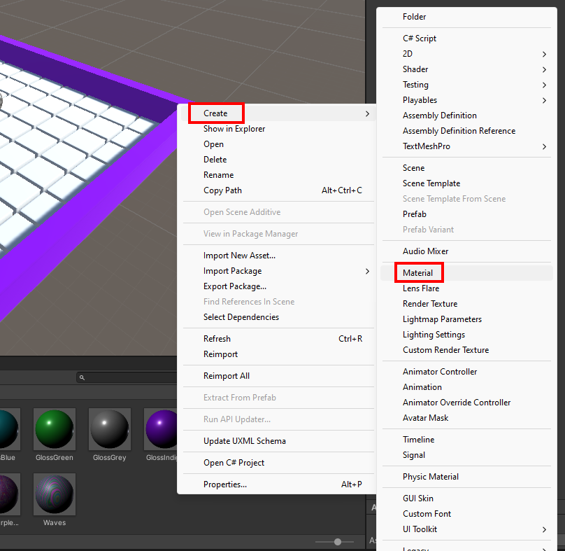
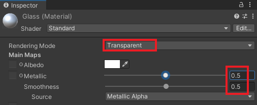

In the 'Project' window. Make sure that you are inside the 'Materials' folder.

Right-click and select 'Create' -> 'Material'. Name the new material 'Glass'.

With the 'Glass' material selected. Go to the 'Inspector' window.

Change the 'Rendering Mode' to 'Transparent'.

Set 'Metallic' to `0.5` and set 'Smoothness' to `0.5`.

Click on the white paint sample next to 'Albedo' and set the 'Alpha' channel to `0`.

